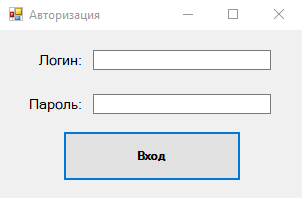
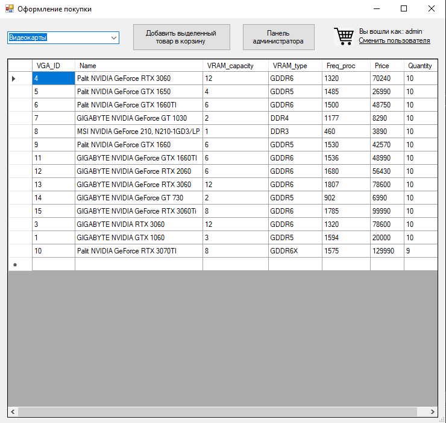
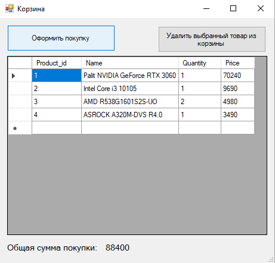
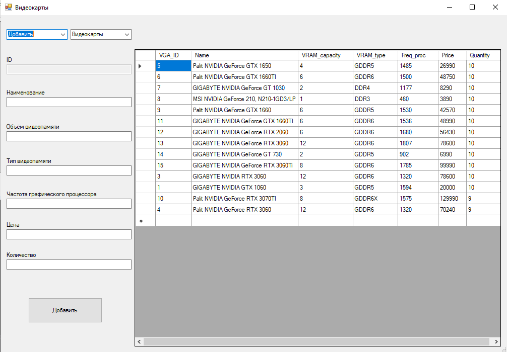
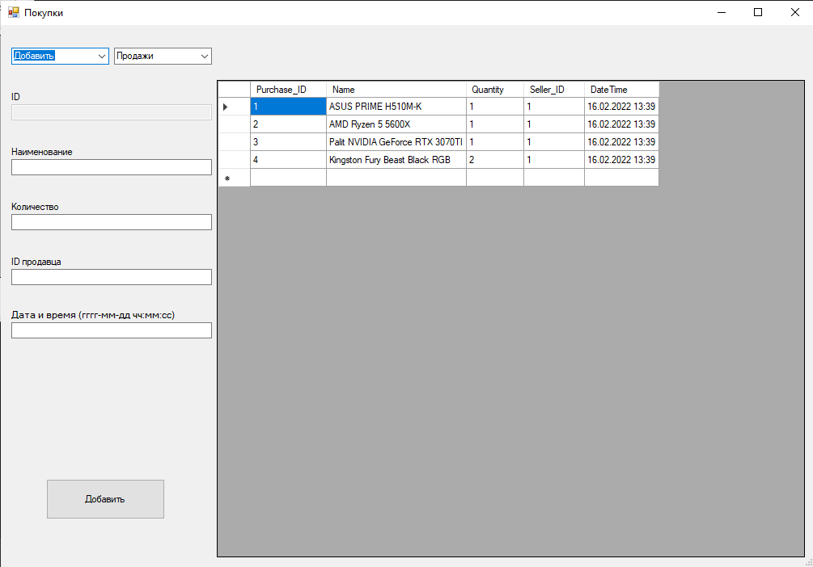

# CompShop

Программа, реализующая модель компьютерного магазина. 

В основе лежит C# с использованием WindowsForms и базы данных PostgreSQL.

---

# Руководство пользователя

При заходе в программу необходимо авторизоваться. 

Список аккаунтов пользователей находятся в соответствующей таблице базы данных.
Управлять этим списком может Администратор.

На данный момент, программа поддерживает только два вида пользователй: ***Администратор*** и ***Продавец-консультант***. Отличие заключается
лишь в наличии панели Администратора, которая, соответственно, есть только у пользователя с должностью "Администратор".

Как Продавец-консультант, так и Администратор могут добавлять товары из выбранной категории в корзину. Для этого необходимо 
выделить нужный товар и нажать на кнопку ***"Добавить выделенный товар в корзину"***. Далее, при заходе в саму корзину нажатием на значок,
покажется список товаров в корзине, информация об их количестве и цене и общая стоимость покупки.

При нажатии на ***кнопку оформления заказа*** все товары из корзины уберутся со склада в выбранном количестве и занесутся в список проданных товаров.

Товар можно удалить из корзины нажатием на ***соответствующую кнопку***. При удалении, количество данного товара в корзине изменится, 
и общая сумма покупки уменьшится.

Панель администратора выполняет следующие функции:
- Добавление, удаление и редактирование товаров (Видеокарты, Процессоры, Материнские платы, Оперативная память) находящихся на складе.
- Редактирование списка аккаунтов, имеющих доступ к данной программе.
- Просмотр списка проданных товаров.
Переключение между категориями, которые нуждаются в редактировании осуществляется посредством их выбора в правом комбо-боксе сверху.
Для выбора действия, которое необходимо совершить с данными, предназначен левый комбо-бокс.

При совершении покупки, список проданных товаров отобразится в таблице "Продажи", в которую можно попасть из панели администратора.
У каждого товара будет отображаться его название, количество, дата и время продажи, а так же id сотрудника, который его продал.

